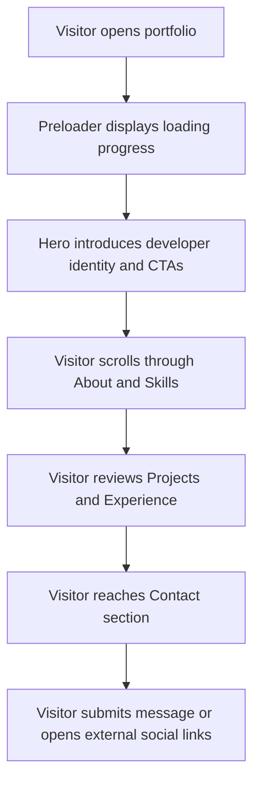

## 1. Product Overview
An advanced single-page developer portfolio that blends cinematic 3D visuals, refined motion, and strong content hierarchy to present personal brand, technical depth, and project credibility.
- Main goals: showcase identity, skills, featured work, experience, and contact pathways in a memorable interactive format for recruiters, clients, and collaborators.
- Market value: positions the developer as modern, detail-oriented, and technically strong through a premium frontend experience with performance-aware 3D execution.

## 2. Core Features

### 2.1 Feature Module
1. **Home page**: immersive hero, sticky navigation, section-based storytelling, animated transitions, contact conversion.

### 2.2 Page Details
| Page Name | Module Name | Feature description |
|-----------|-------------|---------------------|
| Home page | Preloader | Full-screen loading screen with percentage/progress bar before key 3D assets are ready. |
| Home page | Navbar | Fixed glassmorphism navigation, shrink on scroll, active section tracking, mobile drawer, theme toggle. |
| Home page | Hero | Split layout with personal intro, animated role reveal, CTA buttons, social links, and interactive 3D avatar scene. |
| Home page | Hero background | Animated particles, gradient/blob lighting, and scroll-down cue for depth and motion continuity. |
| Home page | About | Bio, education, interests, counters, and subtle floating visual decoration. |
| Home page | Skills | Categorized skill groups, animated bars/cards, iconography, hover tilt interactions, and section reveals. |
| Home page | Projects | Responsive card grid or carousel, project media, tech tags, motion reveals, and modal/detail interactions. |
| Home page | Experience | Animated vertical timeline with alternating desktop layout and single-column mobile experience. |
| Home page | Contact | Validated contact form, animated focus/submit states, social links, and optional reactive 3D accent object. |
| Home page | Footer | Quick links, social icons, copyright, and back-to-top interaction with smooth scroll. |
| Home page | UX system | Lenis smooth scrolling, Framer Motion transitions, GSAP ScrollTrigger section reveals, custom desktop cursor. |
| Home page | SEO and performance | Meta tags, lazy-loaded 3D models, compressed assets, and reduced-motion friendly behavior. |

## 3. Core Process
Visitors land on the portfolio, see a branded preloader, then enter the hero where the value proposition and 3D avatar establish first impression. As they scroll, each section reveals progressively: background story, capabilities, proof of work, experience, and a final contact conversion path. Navigation remains available at all times with smooth scrolling between sections and responsive access on mobile.

## 4. User Interface Design

### 4.1 Design Style
- Overall aesthetic: dark-by-default cinematic neo-industrial portfolio with luminous cyan, electric amber, and soft off-white accents over graphite surfaces.
- Button style: softly rounded glass buttons with layered glow, subtle depth, and motion-rich hover states.
- Typography: expressive display font for headings paired with a clean readable sans-serif for body copy; typography should feel editorial rather than template-like.
- Layout style: desktop-first asymmetrical composition with split hero, layered depth, and modular stacked sections below.
- Icon style suggestions: minimal line/duotone icons with restrained glow, consistent stroke weight, and polished hover motion.

### 4.2 Page Design Overview
| Page Name | Module Name | UI Elements |
|-----------|-------------|-------------|
| Home page | Preloader | Full-screen overlay, progress indicator, blurred light bloom, staged text reveal. |
| Home page | Navbar | Frosted backdrop, slim border, active underline/pill, animated drawer, compact scrolled state. |
| Home page | Hero | Large heading, animated subtitle, short body copy, social icons, dual CTA buttons, 3D scene, ambient particles, scroll cue. |
| Home page | About | Two-column narrative layout, glass stat cards, numeric count-up animation, supporting decorative shapes. |
| Home page | Skills | Category tabs or grouped blocks, icon cards, animated progress bars, perspective hover response. |
| Home page | Projects | Featured card layout with media preview, tags, motion reveal, modal overlay, hover depth and highlight sweep. |
| Home page | Experience | Central timeline spine, alternating cards, date badges, line-draw and staggered fade entrance. |
| Home page | Contact | Glass form panel, animated labels/borders, success feedback, supporting CTA links, optional 3D accent. |
| Home page | Footer | Compact link grid, social buttons, back-to-top control, subtle divider and soft gradient fade. |

### 4.3 Responsiveness
- Desktop-first layout with adaptive tablet and mobile breakpoints.
- 3D scene scales down on smaller screens while preserving visual hierarchy and performance.
- Mobile navigation uses a slide-in drawer with touch-friendly targets.
- Project cards, timeline entries, and contact form collapse gracefully into a single-column rhythm.
- Pointer-heavy interactions such as custom cursor and tilt effects should degrade cleanly on touch devices.

### 4.4 3D Scene Guidance
- Environment and mood: dark atmospheric studio look with subtle colored rim light and soft fog-like depth.
- Lighting setup: key light from front-left, cool rim light, low-intensity fill, optional environment preset for reflections.
- Camera settings and motion: fixed hero framing with subtle mouse-reactive parallax, entrance dolly/scale motion on load.
- Composition and focal elements: avatar or abstract developer-themed model anchored right side, with floating particles or blob backdrop behind.
- Interactions and animations: idle float, gentle rotation, mouse-reactive look-at/parallax, section-aware pause/resume if needed.
- Post-processing effects: restrained bloom or vignette only if performance budget allows.
- Asset sources and performance budgets: lazy-load compressed `.glb` models, prefer Draco compression, keep initial above-the-fold 3D payload lean.
