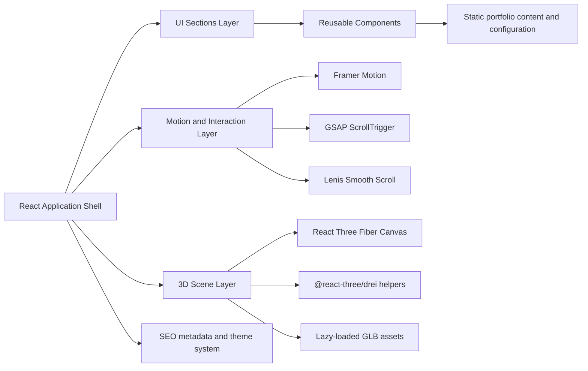

## 1. Architecture Design



## 2. Technology Description
- Frontend: React@19 + Vite@8 + Tailwind CSS@3
- Animation: Framer Motion + GSAP@3 with ScrollTrigger
- Smooth scrolling: Lenis
- 3D: three + @react-three/fiber + @react-three/drei
- Icons: react-icons
- Form handling: lightweight controlled React form state with custom validation
- Initialization base: existing Vite React application in `portfolio/`

## 3. Route Definitions
| Route | Purpose |
|-------|---------|
| / | Single-page portfolio containing all sections and in-page scroll navigation |

## 4. Data Definitions
The portfolio is primarily content-driven and does not require a backend for the first version. Content should be stored in modular local configuration objects to keep components reusable and easy to update.

```ts
type NavItem = {
  id: 'home' | 'about' | 'skills' | 'projects' | 'experience' | 'contact'
  label: string
}

type SocialLink = {
  label: string
  href: string
  icon: string
}

type SkillGroup = {
  title: string
  items: Array<{
    name: string
    level: number
    icon: string
  }>
}

type ProjectItem = {
  slug: string
  title: string
  summary: string
  image: string
  tags: string[]
  liveUrl?: string
  githubUrl?: string
}

type ExperienceItem = {
  company: string
  role: string
  duration: string
  description: string[]
}
```

## 5. Folder Structure

```text
portfolio/
├─ public/
│  ├─ favicon.svg
│  ├─ icons.svg
│  └─ models/
│     └─ avatar.glb
├─ src/
│  ├─ app/
│  │  ├─ AppProviders.jsx
│  │  └─ routes.jsx
│  ├─ components/
│  │  ├─ common/
│  │  │  ├─ AnimatedCursor.jsx
│  │  │  ├─ Preloader.jsx
│  │  │  ├─ ThemeToggle.jsx
│  │  │  └─ SectionHeading.jsx
│  │  ├─ layout/
│  │  │  ├─ Navbar.jsx
│  │  │  ├─ MobileMenu.jsx
│  │  │  └─ Footer.jsx
│  │  ├─ motion/
│  │  │  ├─ PageTransition.jsx
│  │  │  └─ Reveal.jsx
│  │  └─ ui/
│  │     ├─ GlassButton.jsx
│  │     ├─ SocialLinks.jsx
│  │     ├─ ProjectCard.jsx
│  │     ├─ StatCard.jsx
│  │     └─ TimelineItem.jsx
│  ├─ sections/
│  │  ├─ Hero.jsx
│  │  ├─ About.jsx
│  │  ├─ Skills.jsx
│  │  ├─ Projects.jsx
│  │  ├─ Experience.jsx
│  │  └─ Contact.jsx
│  ├─ models/
│  │  ├─ HeroAvatar.jsx
│  │  └─ SceneParticles.jsx
│  ├─ hooks/
│  │  ├─ useActiveSection.js
│  │  ├─ useLenis.js
│  │  ├─ useTheme.js
│  │  └─ useReducedMotion.js
│  ├─ data/
│  │  ├─ site.js
│  │  ├─ skills.js
│  │  ├─ projects.js
│  │  └─ experience.js
│  ├─ utils/
│  │  ├─ animation.js
│  │  ├─ scroll.js
│  │  └─ seo.js
│  ├─ styles/
│  │  ├─ globals.css
│  │  └─ tailwind.css
│  ├─ App.jsx
│  └─ main.jsx
├─ tailwind.config.js
└─ postcss.config.js
```

## 6. Section-by-Section Build Order
1. App shell, theme system, Tailwind integration, and global motion setup
2. Navbar and Hero
3. About and Skills
4. Projects
5. Experience
6. Contact and Footer
7. Preloader, cursor polish, SEO, and performance pass

## 7. Rendering and Interaction Strategy
- Use a single hero `Canvas` rather than multiple heavy canvases to keep GPU usage controlled.
- Lazy-load 3D model components with `React.lazy` and `Suspense`.
- Keep `OrbitControls` disabled for the hero scene; use pointer-driven motion instead.
- Use GSAP ScrollTrigger for timeline drawing, counter animation, and section reveal orchestration.
- Use Framer Motion for menu drawer, button states, modal transitions, and initial section choreography.
- Use Lenis as the unified scroll driver and sync ScrollTrigger updates accordingly.

## 8. SEO and Performance Strategy
- Add descriptive title, meta description, Open Graph tags, and canonical URL support in the document head.
- Use semantic section landmarks and heading hierarchy for accessibility and discoverability.
- Prefer optimized images and compressed `.glb` models; keep large media below the fold lazy-loaded.
- Respect reduced-motion preferences by dialing down cursor, parallax, and reveal intensity.
- Use code splitting for 3D modules and modal/detail content where appropriate.

## 9. Technical Decisions
- Keep the site as a single-page portfolio to maximize narrative flow and smooth-scroll experience.
- Use modular local data files so content edits do not require touching animation-heavy components.
- Tailwind will provide layout, spacing, and theme token velocity, while selective CSS can support advanced visual effects where needed.
- The first implementation milestone should focus on Navbar and Hero, matching the requested build order and establishing the visual language for later sections.
